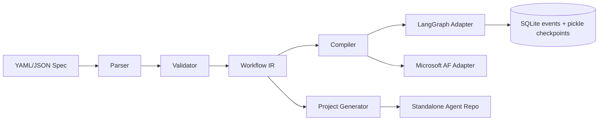

# Architecture

AgentForge is a **compile pipeline**, not a hosted runtime platform.

## Packages

| Package | Role |
|---------|------|
| `schema` | Pydantic DSL models |
| `parser` | YAML/JSON → IR |
| `validator` / `linter` | Structured diagnostics |
| `ir` | Canonical graph IR |
| `compiler` | Bind IR to runtime |
| `runtimes` | LangGraph / Microsoft adapters |
| `generator` | Standalone project codegen |
| `architect` | NL → validated YAML |
| `tools` / `mcp` | Tool + MCP grants |
| `policies` / `security` | Budgets, allowlists, guardrails |
| `evaluation` / `observability` | Scoring + event traces |
| `cli` / `sdk` | Developer surfaces |

## Design rules

1. IR is the source of truth after parse.
2. Adapters declare capabilities; unsupported features raise errors.
3. Generated projects do **not** depend on the AgentForge package at runtime.
4. HITL interrupts persist under `.agentforge/` so CLI `resume` works in a new process.
5. LLM credentials come only from environment variables.
